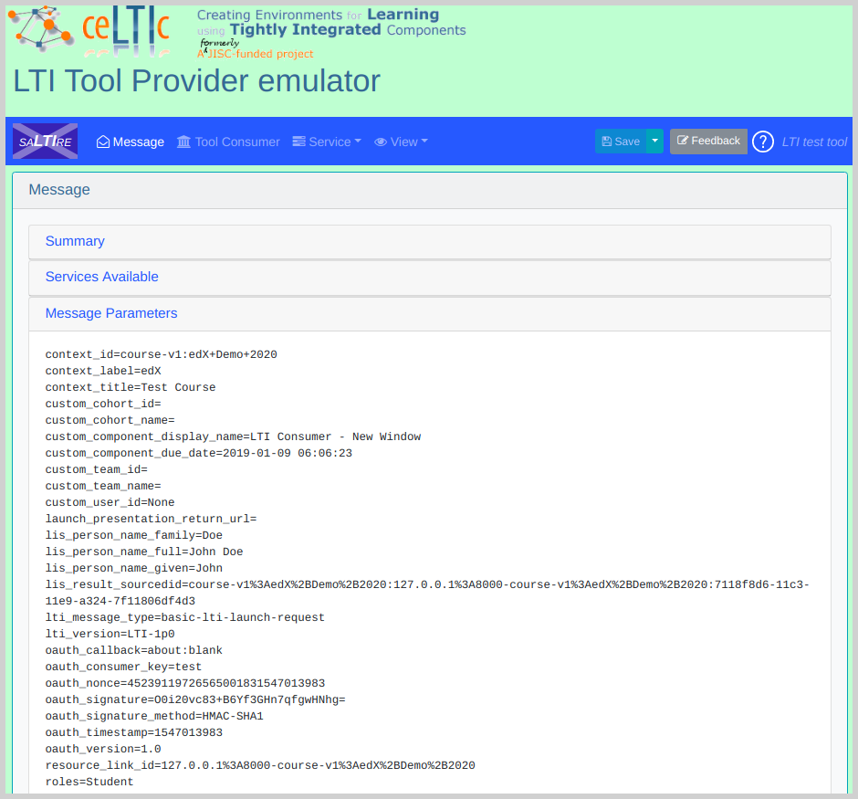

# Tahoe LTI Processors
Tahoe Customizations for the LTI Consumer XBlock: Additional team and user fields.

## How it Works
This package uses the LTI Consumer XBlock interface to add extra parameters
in addition to the default LTI parameters.

## Usage
Install the pip package:

```
$ pip install git+https://github.com/appsembler/tahoe-lti.git
```

Add the following settings to your `server-vars.yml` (or whatever method you configure your Open edX installation):

```yaml
EDXAPP_XBLOCK_SETTINGS:
  lti_consumer:
    parameter_processors:
      - 'tahoe_lti.processors:basic_user_info'
      - 'tahoe_lti.processors:personal_user_info'
      - 'tahoe_lti.processors:cohort_info'
      - 'tahoe_lti.processors:team_info'
```

**Legal Notice:** Both ``basic_user_info`` and ``personal_user_info`` sends personal user information to potential 3rd-party LTI providers.
Please make sure that this is reflected on the Privacy Policy of the site.

In case the same LTI configuration used for multiple edX installations, alternatively you may want to replace `personal_user_info` processor by `personal_user_info_with_combined_user_id`. The `personal_user_info_with_combined_user_id` processor does exactly the same what `personal_user_info`, but using the hash of the user's email address and join date ensuring that the user can have the same email address across edX installations.

Restart the Open edX instance and it should be working.

### How to Test?
 - Set the LTI Passports to `test:test:secret` in the course advanced settings.
 - Add the `lti_consumer` to the advanced modules.
 - From the advanced modules create a new LTI module
 - Configure the module like the following:
   * URL: `https://lti.tools/saltire/tp`
   * LTI ID: `test`
   * Set **Send extra parameters** to `true`
 - Check the LTI test and you should see the custom parameters: 
 
   
   
   _Click on the image to enlarge._


### Development Guide
You can use whatever workflow you prefer when developing XBlocks, if you don't have one, here's a suggestion:

 - Install the XBlock SDK. Use the version in [edx/xblock-sdk#142](https://github.com/edx/xblock-sdk/pull/142) or later.
 - All the steps below should be run within the XBlock SDK virtual environment
 - Install the Consumer LTI XBlock.
 - Checkout this repo
 - Install this repo in edit mode `$ pip install -e tahoe-lti`
 - Go to In the XBlock SDK and add a `private.py` settings file with the settings above to enable the processors
 - Run the XBlock SDK and choose the `LTI Consumer XBlock` scenario

